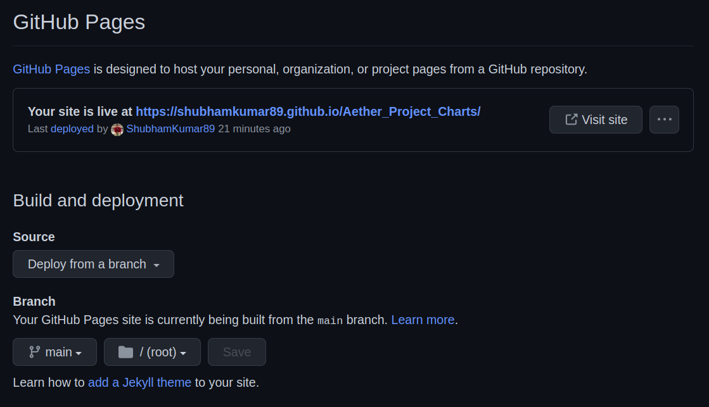

# How to Replicate

### 1. Download Helm Charts

Download all the `.tgz` files from `https://charts.aetherproject.org/`

```bash
wget -r -A .tgz https://charts.aetherproject.org/
```

### 2. [Install helm](https://helm.sh/docs/intro/install/)

```bash
curl -fsSL -o get_helm.sh https://raw.githubusercontent.com/helm/helm/main/scripts/get-helm-3
chmod 700 get_helm.sh
./get_helm.sh
```

### 3. Build and Deploy on Github Pages

Go to `Repository-setting` --> `Code and automation` --> `Pages` --> `Build and Deployment` --> `Branch` -- Select `main`

Wait for few minutes and then your site will be live at ` https://username.github.io/repository/`.

#### Example



### 4. Generate `index.yaml`

This command will generate an `index.yaml` file in the `charts.aetherproject.org` directory. The `--url` flag sets the base **URL** that the charts can be found at in the generated `index.yaml` file.

```bash
helm repo index . --url https://username.github.io/Aether_Project_Charts/

# move the index.yaml in the parent directory
```

### 5. Generate `README.md`

```bash
wget -O - https://charts.aetherproject.org/ > README.md
```

### 6. Limit Access

The `robots.txt` file is a file at the root of your website that indicates those parts of your site you don’t want accessed by search engine crawlers. The file uses the Robots Exclusion Standard, which is a protocol with a small set of commands that can be used to indicate access to your site by section and by specific kinds of web crawlers (_such as mobile crawlers vs desktop crawlers_).

```bash
echo -e "User-Agent: *\nDisallow: /" > robots.txt
```
